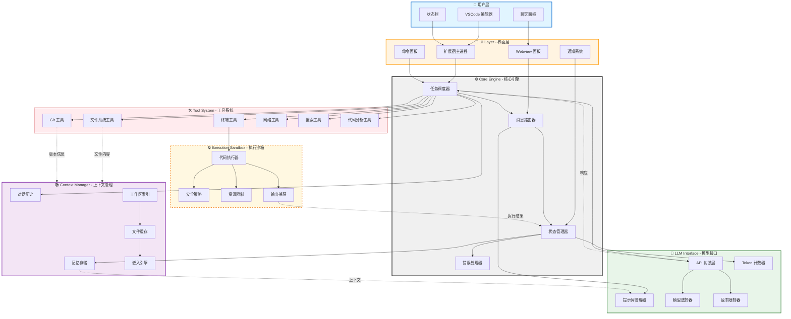
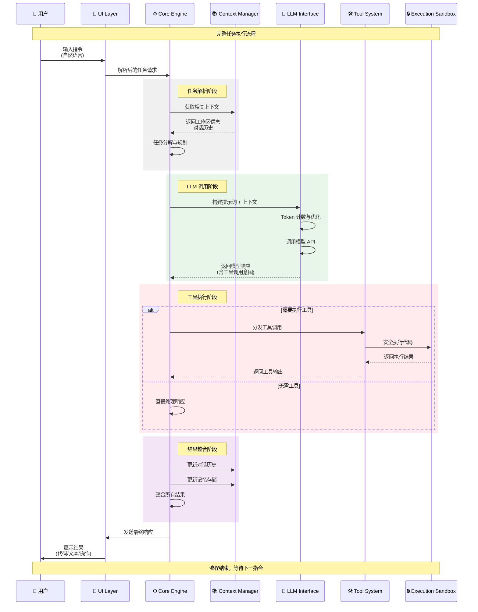
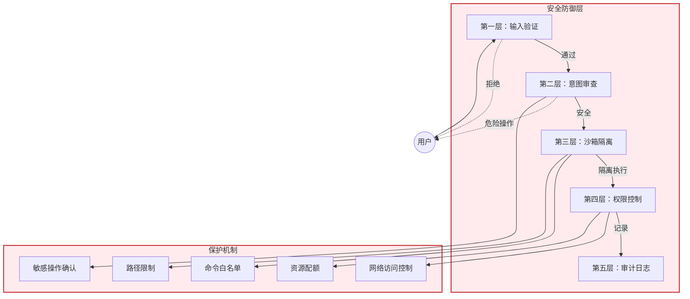

# Cline AI 编码助手架构图

## 架构总览



## 数据流详细图



## 组件详细架构

```mermaid
flowchart LR
    subgraph UI_Components["UI Layer 组件详情"]
        UI1[任务输入框]
        UI2[代码预览面板]
        UI3[工具调用日志]
        UI4[进度指示器]
        UI5[配置面板]
    end

    subgraph Core_Components["Core Engine 组件详情"]
        C1[意图识别模块]
        C2[任务队列]
        C3[依赖解析器]
        C4[执行协调器]
        C5[结果聚合器]
    end

    subgraph LLM_Components["LLM Interface 组件详情"]
        L1[API 客户端集群]
        L2[提示词模板库]
        L3[响应解析器]
        L4[流式处理器]
        L5[降级策略]
    end

    subgraph Context_Components["Context Manager 组件详情"]
        M1[短期记忆]
        M2[长期记忆]
        M3[向量数据库]
        M4[文件 watcher]
        M5[符号索引]
    end

    subgraph Tool_Components["Tool System 组件详情"]
        T1[文件读/写/搜索]
        T2[shell 命令执行]
        T3[git 操作封装]
        T4[HTTP 请求工具]
        T5[代码解析器]
        T6[测试运行器]
    end

    subgraph Sandbox_Components["Execution Sandbox 组件详情"]
        S1[Docker 容器]
        S2[权限检查]
        S3[超时控制]
        S4[资源监控]
        S5[输出过滤]
    end

    UI_Components --> Core_Components
    Core_Components --> LLM_Components
    Core_Components --> Context_Components
    Core_Components --> Tool_Components
    Tool_Components --> Sandbox_Components

    classDef detail fill:#ffffff,stroke:#666666,stroke-width:1px
    class UI_Components,Core_Components,LLM_Components,Context_Components,Tool_Components,Sandbox_Components detail
```



## 安全架构



## 渲染说明

### 在线渲染

1. **Mermaid Live Editor** (推荐)
   - 访问：https://mermaid.live/
   - 复制上方任意代码块粘贴即可实时预览
   - 支持导出 PNG/SVG

2. **GitHub/GitLab**
   - 在 Markdown 文件中直接使用 ```mermaid 代码块
   - 平台会自动渲染

### 本地渲染

1. **VSCode 扩展**
   ```bash
   # 安装 Mermaid 预览扩展
   # 扩展 ID: bierner.markdown-mermaid
   ```

2. **Node.js CLI**
   ```bash
   npm install -g @mermaid-js/mermaid-cli
   mmdc -i input.mmd -o output.png
   ```

3. **Python**
   ```bash
   pip install mermaid
   # 使用 Python 脚本渲染
   ```

### 文件位置

- 本架构图已保存至：`/home/admin/.openclaw/workspace/cline-architecture.md`
- 可单独提取各代码块保存为 `.mmd` 文件

---

**架构特点总结：**

✅ **层次清晰**：6 大核心组件分层明确，职责单一  
✅ **数据流向**：双向箭头标注数据回流路径  
✅ **安全优先**：独立的安全架构和沙箱设计  
✅ **可扩展**：模块化设计便于添加新工具和能力  
✅ **生产就绪**：包含错误处理、速率限制、资源监控等生产特性
